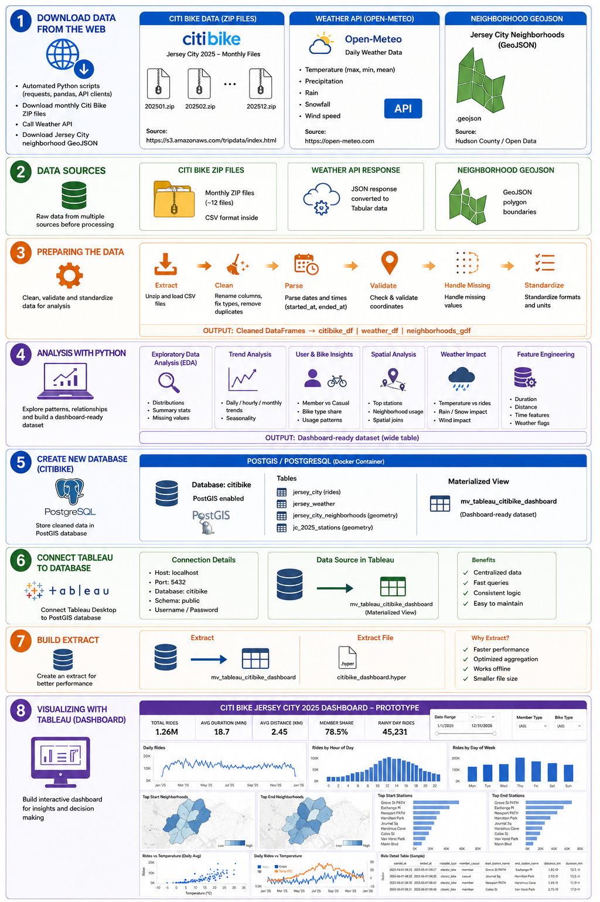

# Citibike Analytics Platform

## Project Overview

This project is an end-to-end data analytics solution that analyzes Citi Bike ride patterns in Jersey City using trip data from **2025–2026**.

The goal of the project is to understand ride demand, user behavior, station performance, geographic patterns, and the impact of weather conditions through data engineering, SQL analysis, and interactive visualization.

The project covers the complete analytics workflow:

**Data Collection → Data Cleaning → ETL Pipeline → Database Design → Spatial Analysis → Dashboard Development**



---

## Business Questions

This project explores questions such as:

* How does ride demand change over time?
* What are the busiest hours and days for Citi Bike usage?
* How do member and casual riders behave differently?
* Which stations and neighborhoods generate the most trips?
* How does weather affect bike usage?
* What are the most common ride distances and durations?

---

## Data Sources

### Citibike Trip Data

Monthly Citi Bike trip datasets were collected for Jersey City:

* 2025–2026 ride data
* Ride timestamps
* Bike type
* Rider membership type
* Start/end stations
* Geographic coordinates

### Weather Data

Weather information was collected using the Open-Meteo API:

* Average, minimum, and maximum temperature
* Precipitation
* Rain
* Snowfall
* Wind speed

---

## Data Pipeline

### 1. Data Collection & ETL (Python)

Implemented an automated ETL workflow using Python:

* Downloaded monthly Citi Bike datasets
* Extracted and combined CSV files
* Cleaned and validated ride records
* Handled missing values and duplicates
* Enriched trip data with weather information

---

### 2. Database Design (PostgreSQL + PostGIS)

The database runs in a **Dockerized PostgreSQL/PostGIS** environment (see `docker-compose.yaml`).

Created an analytical database structure:

| Table                       | Purpose                   |
| --------------------------- | -------------------------- |
| `jersey_city`               | Ride-level Citi Bike data  |
| `jersey_weather`            | Daily weather information  |
| `jersey_city_neighborhoods` | Neighborhood polygon data  |
| `jc_2025_stations`          | Station spatial data       |

PostGIS was used for spatial analysis, including:

* Mapping ride locations
* Assigning neighborhoods to rides
* Calculating ride distances

---

## Analytical Layer

Created a dashboard-ready materialized view:

```
mv_tableau_citibike_dashboard
```

The view combines:

* Ride information
* Date and time features
* Weather metrics
* Neighborhood data
* Distance calculations
* Analytical categories

Examples:

* Ride duration groups
* Distance groups
* Temperature groups
* Precipitation flags

Materialized views and indexes were used to improve Tableau performance.

---

## Tableau Dashboard

The interactive dashboard includes:

* KPI overview (total rides, avg duration/distance, member share, rainy-day rides)
* Ride trend analysis (daily, hourly, weekday vs weekend)
* Member vs casual rider and bike type breakdowns
* Geographic analysis by station and neighborhood
* Weather impact analysis (temperature, precipitation)

---

## Dashboard Preview

Example:

[Daily Rides vs Precipitation](imgs/Daily-Rides-vs-Precipitation.png)

[Number of Citibike Rides per Month](imgs/Number-of-Citi-Bike-Rides-per-Month.png)

[Daily Rides vs Average Temperature](imgs/Daily-Rides-vs-Average-Temperature.png)

---

## Technologies

* **Programming:** Python
* **Database:** PostgreSQL, PostGIS, SQL, Docker
* **Visualization:** Tableau
* **APIs:** Open-Meteo API
* **Tools:** Git

*(Full list of Python libraries and versions is available in `requirements.txt`)*

---

## Project Structure

```
citibike/
│
├── data/
│   └── citibike/
│       ├── JC/
│       ├── processed/
│       └── raw/
│
├── notebooks/
│   ├── 1_Download_Citibike_Jersey_Data.ipynb
│   ├── 2_Data_Enrichment.ipynb
│   ├── 3_Weather_Data.ipynb
│   ├── 4_Data_Visualization.ipynb
│   ├── 5_Neighborhood_Analysis.ipynb
│   └── 6_SQLAlchemy.ipynb
│
├── postgis_data/
│
├── docker-compose.yaml
├── requirements.txt
├── citibike_dashboard.twbx
└── README.md
```

---

## Key Skills Demonstrated

* Data cleaning and transformation
* ETL pipeline development
* SQL analytics
* Database design
* Spatial analytics with PostGIS
* API integration
* Dashboard development
* Data visualization
* Performance optimization
* Containerized database environments (Docker)